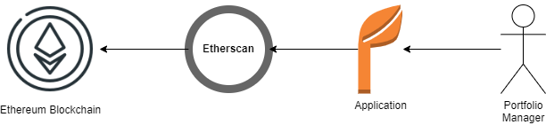
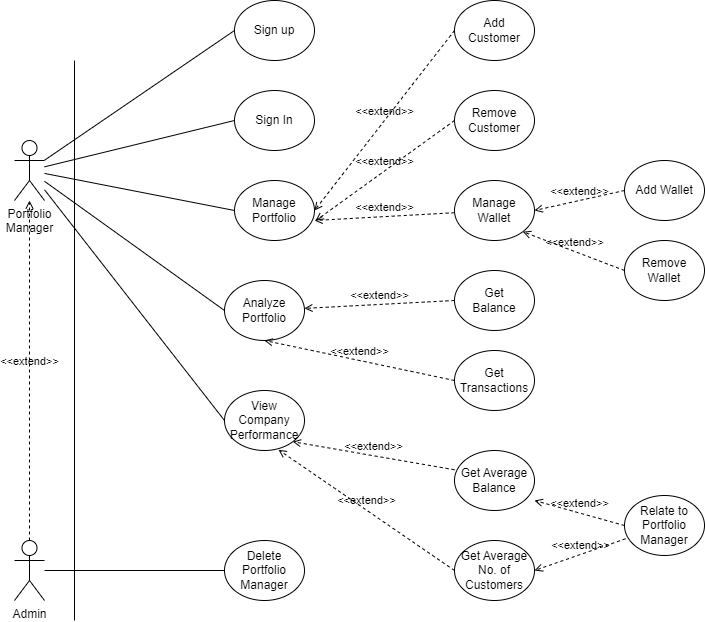
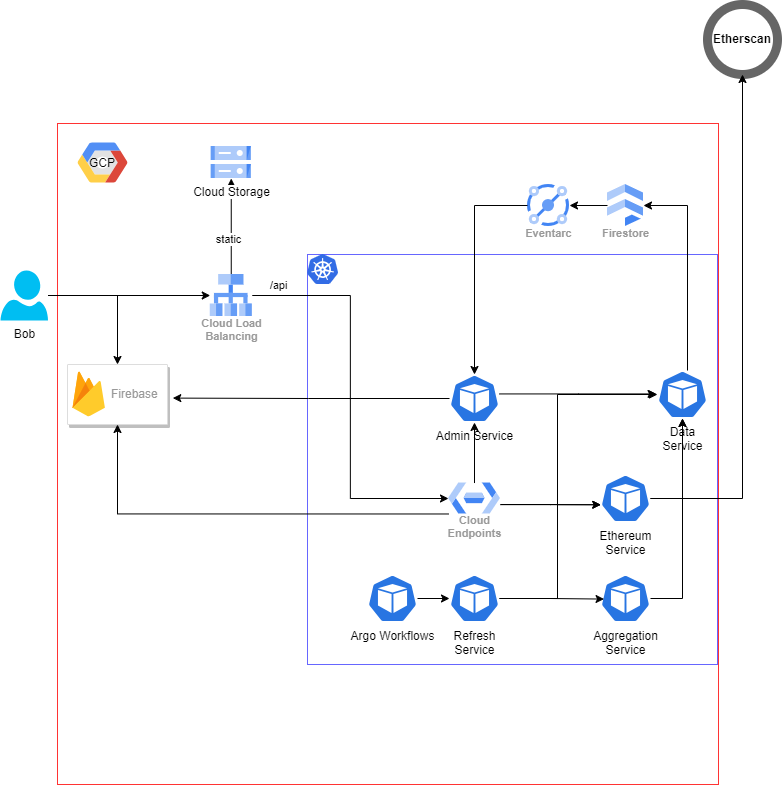
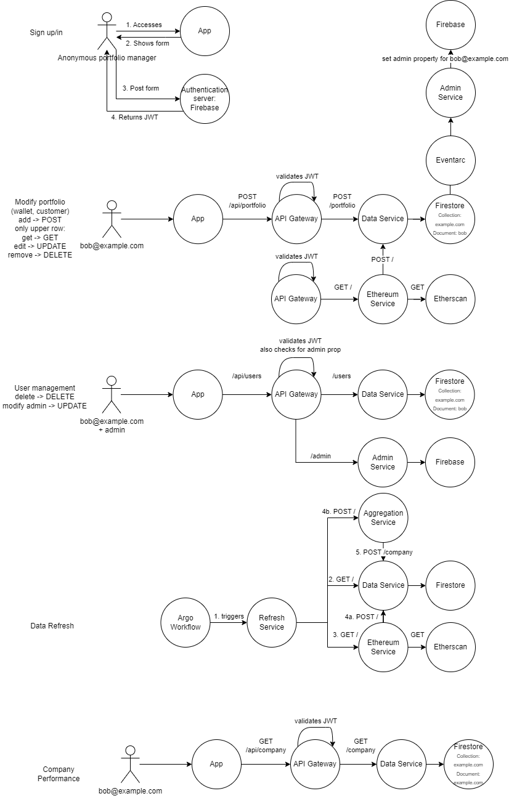

# Project Goals

## Problem description
Portfolio and asset managers need to track the balances and transactions of their customers. In the blockchain world, users have lots of wallets. This makes it very difficult for asset managers to get a unified view of their customers' performance in a blockchain.
This is especially true, when it comes to the Ethereum blockchain. Multiple smart contracts and a token (e.g. NFT) based economy necessitate a huge range of wallets further complicating the problem.
## Goal
We want to solve this problem by providing asset and portfolio managers a way to track the performance of their customers. To do that we provide a web application that provides the ability to track multiple customers and their wallets. Specifically, we track balances and transactions of the wallets. To help portfolio managers with their tasks, we provide additional analysis capabilities in the app, to track both their individual performance as well as their comparative performance with respect to the company.

# Main Features and Scope


## System Context


## Use Case
### Sign up / sign in
We provide authentication capabilities for portfolio managers.

### Manage portfolio
A portfolio manager can add, modify, and remove customers and their wallets.

### Analyze portfolio
We provide a view to the user showing the balances and transactions of his customers.

### View company performance
We provide a view to the user showing the performance of the user compared to his company, i.e. all the other users in his company / tenant.

### Delete user
If a user is an admin he can remove other users from his company or make them admin as well. To do that he gets a separate view.




# Architecture
We expose our application using an application load balancer in GCP. Static content will be delivered from a bucket in Cloud Storage.
Client-side we use a single page application written in React.Authentication is handled on the client side together with Identity Platform / Firebase.
We separate our backend API on the application load balancer with the /api path prefix. On every request from the client side to the backend we send a JWT (JSON Web Token) along, signed by Firebase, authenticating the user.
The ALB forwards API requests to an API Gateway deployed on Kubernetes. The API Gateway is powered by Google's Cloud Endpoints.
The API Gateway performs an authentication check for all API requests by validating the JWT. For some admin actions it further performs an authorization check by ensuring the presence of the admin property.
The API Gateway routes traffic to the different Kubernetes services listed below. All Kubernetes services are fronted by a network load balancer.
Data is stored in the NoSQL database Firestore. Data is acquired from Etherscan API. Data is refreshed in Firestore on a regular basis. This scheduled event is triggered by Argo Workflows which is an open source workflow management tool.
We achieve multitenancy by differentiating the users on their email domains. For example bob@example.com will be part of the example.com organization.
Different tenants are separated from each other in Firestore via different data collections. On first creation of a collection, i.e. first sign-up of a user from a new domain, the initial user receives the admin property. This is achieved by Eventarc in combination with a Kubernetes Admin Service (Eventarc triggers the service on collection creation).

## Microservices

### Data Service
Description: Handles all data inserts and queries into Firestore. The service requires that the input has a populated "user" field containing the email address of the user. The email domain is used to determine the Firestore collection. The user name in the email address is used to find the document in the collection.

The transaction fields are described
[here](https://ethereum.org/en/developers/docs/transactions/#whats-a-transaction).

Software Components: Single container

Runtime Components: Kubernetes service (NLB + set of pods)

Interfaces: Output looks similar to input when inserting to Firebase. When querying the service the output looks similar to the input below.
```
input = {
        "user": "bob@example.com",
        "customers": [{
            "name": "customer1",
            "address": "Germany, 80805 Munich, Abcstrasse 3", // optional
            // ...
            "wallets": [
                {
                    "account": "0x123",
                    "balance": 10.3 // optional
                    "transactions": [
                        {
                            "blockNumber":"14923678",
                            "timeStamp":"1654646411",
                            "hash":"0xaaa",
                            "blockHash":"0xbbb",
                            "transactionIndex":"61",
                            "from_address":"0x234",
                            "to_address":"0x123",
                            "value":"0",
                            "gas":"6000000",
                            "gasPrice":"83924748773",
                            "isError":"0",
                            "txreceipt_status":"1",
                            "gasUsed": "4457269",
                            ...
            
                        }
                    ]
                }
            ]
        }]
}
```
Datastores: Firestore

### Aggregation Service
Description: Uses the Data service to get all wallet balances and transactions across all collections and documents. For every collection (tenant) it performs various aggregations, e.g. average of all balances. The result is sent back to the Data service which in turn stores the data in a special document that has the same name as the collection.

Software Components: Single container

Runtime Components: Kubernetes service (NLB + set of pods)

Interfaces: see Data service
Datastores: -
### Admin Service
Description: Takes a user as input and either 
- sets or unsets the admin property of that user
- or deletes the user in Firebase.
Furthermore, it also relays the information to the Data service

Software Components: Single container

Runtime Components: Kubernetes service (NLB + set of pods)

Interfaces:
```
{
    "user": "bob@example.com",
    "action": "delete|set|unset"
}
```
Datastores: Firebase
### Ethereum Service
Description: Accepts wallets as input and queries Etherscan API for the balances and transactions. The acquired information is then forwarded to the Data service.

Software Components: Single container

Runtime Components: Kubernetes service (NLB + set of pods)

Interfaces: Data service, Etherscan

Datastores: -

### Refresh Service
Description: Regularly called by Argo Workflows. Responsible for refreshing the data in Firestore. To do that it first gets all wallets from the Data service. It then triggers the Ethereum service to get the recent Ethereum data. Finally, it triggers the Aggregation service to keep the company performance in sync.

Software Components: Single container

Runtime Components: Kubernetes service (NLB + set of pods)

Interfaces: Argo Workflows, Aggregation service, Data service, Ethereum service

Datastores: -
## Sequence Diagram



# Multitenancy
We list the different options for multitenancy grouped by the components below. Note that we are flexible across the different tenant types in all components individually.
That means the different tenant types define our different configuration capabilities.
## Components
### Static Content + Application Load Balancer
We have a website with dynamic content where the balances and wallets change. However, static content like HTML, CSS, Javascript, and pictures need to be delivered to the app user's browser. We do this by serving the static content from cloud storage with a load balancer / content distribution network (cdn) in front of it. For multitenancy we have the following options:
- shared infrastructure + no customization: users from different tenants can be served from the same cloud storage using the same static assets.
- shared infrastructure + some customization: users from different tenants can be served from the same cloud storage using different static assets. This allows for customization, e.g. different pictures and welcome messages for different companies. To differentiate different tenants / users from different companies the load balancer can use the DNS name to decide which static content to deliver.  
- isolated infrastructure + full customization: we deploy different load balancers, cloud storage buckets, and completely different static content. Customers access their application with their own custom domains since the load balancer doesnt use pre-known domain names.

For our application we choose shared infrastructure + no customization
### Firebase / GCP Identity platform
- shared infrastructure: users from all companies are listed in a flat structure in Firebase.
- isolated infrastructure + some customization: companies get their own directory in Firebase, i.e. users from different tenants are isolated
- isolated infrastructure + full customiziation: companies can provide their own identity provider that we integrate into firebase. This allows for Single Sign On capabilities.
We choose the first option. We manage tenant isolation by grouping users into different companies / tenants according to their email domain, i.e. user@example.com will be put into the example.com tenant.

Identity platform allows custom claims for users. One customization allows the designation of some users as admins allowing them full visibility and adminstration capabilities for their tenant (e.g. manually remove users from the tenant). Further customization can be achieved by providing a full fledged access control system (e.g. role based or attribute based).
### Firestore
- Shared infrastructure: we have 1 collection in Firestore and different documents for the individual tenants
- Shared infrastructure + some customization: we have multiple collections, one collection per tenant. Every tenant user then gets its own document.
- Isolated infrastructure: we have different google projects for every tenant. This in turn means that every tenant has its own collection in firestore and every user of that tenant its own document. Compared to the previous case we have full data isolation which increases security at the cost of complexity.

We choose the second approach.
### API Gateway
- shared infrastructure: all users across all tenants use the same API gateway. Authorization is handled by the API Gateway together with Firebase.
- isolated infrastructure: separate deployment allowing for full DNS customization by the customer.

We choose the first option.
### Kubernetes + Services
- Low isolation: one cluster, one namespace: every microservice is a Kubernetes Service and runs on a set of horizontally scaled pods. All customers across all tenants share the same services. 
- Medium isolation: one cluster, one namespace per tenant: every microservice is a Kubernetes Service and runs on a set of horizontally scaled pods. Customers across different tenants use different services. However, the services still run on the same cluster providing only a virtual separation of workloads.
- High isolation: multiple clusters, one cluster per tenant: This improves on the medium isolation case by separating workloads on a "physical" level.

The higher the isolation mode, the more expensive it becomes. We therefore choose the first option. 
### Refresh Service
- customization: shorter refresh rate of the data in firestore, makes it more responsive to data changes but also more expensive (more api calls against etherscan needed, may require a more expensive subscription). 
We choose an hourly refresh rate.

# Definitions

Blockchain:
- eine technische Lösung, um Daten in einer verteilten Infrastruktur ohne zentrale Instanz nachvollziehbar und manipulationssicher im Konsens zu verwalten. 
- ermöglicht Transaktionen (zum Beispiel im Zahlungsverkehr mit Kryptowährungen) ohne zentrale Instanz (wie eine Bank) vertrauensvoll und transparent zu verifizieren

Kryptowährungen:
- digitales Zahlungsmittel auf der Grundlage eines Blockchain-Systems. Bei Kryptowährungen wird die Übertragung von Guthaben durch eine kryptografisch signierte Transaktion in der Blockchain dokumentiert. Die Verifizierung dieesr Transaktionen übernehmen die im Netzwerk befindlichen Rechner.
- Der Bezahlvorgang wird mittels einer digitalen Geldbörse (wallet) abgewickelt.

Ethereum:
- dezentralisierte Open-Source-Plattform, die auf der Blockchain-Technologie basiert

Ether (Eth):
- Die Kryptowährung der Ethereum Blockchain. Jede Transaktion oder Erstellung von Smart Contracts sowie die Nutzung verschiedener Services der Ethereum-Plattform kostet Ether.

Smart Contracts:
- digitalisierte, determinierte Verträge zwischen zwei oder mehreren Personen oder Softwareprogrammen